<div id="top"></div>

<div align="center">

# 🌍 HORIZON SCAN PROTOTYPE

**Automated invasion risk triage for non-native species in the Southeastern US**

[](LICENSE)
[](https://github.com/SokolAnn/Horizon_Scan_Prototype/commits)
[](https://github.com/SokolAnn/Horizon_Scan_Prototype)

[](https://python.org)
[](https://jupyter.org)
[](https://pandas.pydata.org)
[](https://neo4j.com)
[](https://openai.com)

<br/>

The pipeline retrieves evidence, extracts mechanistic signals from text, represents them in a knowledge graph, and produces **RRAT-style scores** with traceable citations.

[Get Started](#-quickstart) · [View Workflow](#-workflow) · [Scoring Details](#-rrat-scoring)

</div>

---

> **Who is this for?** Invasion ecologists, conservation practitioners, biosecurity teams, and researchers building reproducible, evidence-grounded risk triage workflows.

---

## 📑 Contents

- [Scope](#-scope)
- [Inputs](#-inputs)
- [Workflow](#-workflow)
- [RRAT Scoring](#-rrat-scoring)
- [Confidence & Traceability](#-confidence--traceability)
- [Repository Structure](#-repository-structure)
- [Quickstart](#-quickstart)
- [Limitations](#-limitations)
- [License](#-license)

---

## 🔭 Scope

| Parameter | Detail |
|:--|:--|
| **Region** | Southeastern United States |
| **Species** | Non-native to the Southeast (may be native elsewhere in the US) |
| **Inclusion rule** | Each species must have an invasion history — moved outside its native range at least once |
| **Exclusions** | Marine species and aquatic plants |
| **Project type** | Horizon scan (rapid triage) with stronger documentation than typical scans |

---

## 📥 Inputs

<details>
<summary><b>Core data files</b></summary>

| File | Description |
|:--|:--|
| `data/species/Species.xlsx` | Canonical candidate species list |
| `data/eddmaps/HORIZON_SCAN_combined.xlsx` | EDDMapS export for occurrence evidence (sheets: `observations`, `revisits`, `species`, `data_dictionary`) |
| `data/climatch/species_for_climatch.csv` | Input points per species for climate matching |
| `data/rubric/SERISCC_HS_RRAT(Scoring Tables).csv` | RRAT scoring table definitions |

</details>

<details>
<summary><b>Planned external sources</b> (tracked as citations & derived facts)</summary>

| Source | Use |
|:--|:--|
| **USGS NAS** | Occurrence context and pathway narratives |
| **IUCN spatial data** | Range polygons for distribution context |
| **EPA traits database** | Structured trait backfill and cross-checks |
| **Primary & gray literature** | Mechanistic evidence for pathways, establishment, impacts, management |

</details>

---

## ⚙️ Workflow

```mermaid
flowchart LR
    A["1 · Load &\nnormalize names"] --> B["2 · Ingest\noccurrence data"]
    B --> C["3 · Climate\nmatching"]
    C --> D["4 · Literature\nretrieval"]
    D --> E["5 · Evidence\nextraction"]
    E --> F["6 · Knowledge\ngraph"]
    F --> G["7 · RRAT\nscoring"]
    G --> H["8 · Validation &\nadjudication"]
```



| Step | Detail |
|:--:|:--|
| **1** | Load and normalize species names |
| **2** | Ingest occurrence evidence (EDDMapS + additional sources) |
| **3** | Prepare climate match inputs → compute similarity outputs |
| **4** | Retrieve literature per species using reproducible query templates |
| **5** | Extract structured records (pathways, dispersal, reproduction, overwintering, impacts, management), each linked to a citation |
| **6** | Build a knowledge graph — species, traits, pathways, locations, invasion events, impacts, management actions, evidence |
| **7** | Score each species via RRAT rubric → generate explanation tied to evidence IDs |
| **8** | Assign confidence separately from risk → student validation & adjudication for disagreements |

---

## 📊 RRAT Scoring

Four dimensions scored **1 – 5**. Final risk is their product:

```
FinalRisk = Arrival × Impact × EaseOfEradication × ClimateMatch
```

> 📄 Authoritative scoring language: `data/rubric/SERISCC_HS_RRAT(Scoring Tables).csv`

<details>
<summary>🚚 <b>Arrival (Pathway)</b> — Dispersal mechanisms, anthropogenic movement & spread dynamics</summary>

| Score | Criteria |
|:--:|:--|
| **5** | Long-distance dispersal via natural (e.g., waterways, animal dispersal) **and** anthropogenic pathways (e.g., trade, hitchhiking on commodities/vehicles) **AND** high reproductive rate. Rapid spread from source population. |
| **4** | Infrequent/inefficient spread via natural and anthropogenic pathways **AND** moderate reproductive rates. Rapid spread from source population. |
| **3** | Moderate-distance dispersal (e.g., bird/mammal-dispersed fruits, wind/water adaptations, human-mediated, land bridges) **AND** moderate reproductive rate. Moderate pace of spread from source. |
| **2** | Infrequent/inefficient moderate-distance dispersal **AND** low reproductive rate. Has not spread rapidly from source. |
| **1** | No evidence of long- or moderate-distance dispersal **AND** low reproductive rate. Has not spread rapidly from source. |

</details>

<details>
<summary>💥 <b>Impact</b> — Ecological, socio-economic & human health effects</summary>

| Score | Criteria |
|:--:|:--|
| **5** | Likely to cause **(a)** replacement and local extinction of native species with irreversible community/ecosystem changes, **or (b)** local disappearance of social/economic activity, or major human health effects. |
| **4** | Likely to cause **(a)** local/population extinction of ≥1 native species with reversible community changes, **or (b)** local disappearance of social/economic activity, collapse or abandonment, or moderate health effects. No higher-category impacts. |
| **3** | Likely to cause **(a)** native population declines without community structure changes, **or (b)** reduced participation in social activities, accessibility issues, or mild health effects (e.g., allergies). No higher-category impacts. |
| **2** | Likely to cause **(a)** performance declines in native biota (e.g., biomass, body size) without population declines, **or (b)** minor income loss, health problems, or social disruption. No higher-category impacts. |
| **1** | Unlikely to cause negative impacts on native biota, abiotic environment, human well-being, or economic systems. |

</details>

<details>
<summary>🛡️ <b>Ease of Eradication</b> — Higher score = harder to manage</summary>

| Score | Criteria |
|:--:|:--|
| **5** | No known management techniques **and/or** very low detectability making effective surveillance difficult or impossible. |
| **4** | Management available but not effective; difficult to control without damaging natives; retreatment ≥1×/year over 5 years. **And/or** low detectability requiring extensive surveillance. |
| **3** | Management available; difficult to control without damaging natives; retreatment 1–4× over 5 years. **And/or** moderately detectable, requiring targeted surveillance. |
| **2** | Effective management available; minimal native damage; one retreatment needed. **And/or** highly detectable, enabling effective surveillance. |
| **1** | Effective management available; typically controlled without native damage; no retreatment needed. **And/or** very high detectability for efficient, targeted management. |

</details>

<details>
<summary>🌡️ <b>Climate Match</b> — Derived from climate similarity outputs</summary>

| Score | Criteria |
|:--:|:--|
| **5** | Climate match score is 5 |
| **4** | Climate match score is 4 |
| **3** | Climate match score is 3 |
| **2** | Climate match score is 2 |
| **1** | Climate match score is 1 |

> Climate similarity is computed externally and binned to a 1–5 integer scale.

</details>

---

## 🔍 Confidence & Traceability

> **Risk and confidence are scored separately.**

| Question | Answered by |
|:--|:--|
| *How risky is this species likely to be?* | **Risk score** |
| *How strong is the supporting evidence?* | **Confidence score** |

### Evidence requirements

Every score must be supported by evidence items containing:

- 📎 A **citation pointer** (paper, report, database page)
- 📝 A short **supporting snippet**
- 🏷️ **Extracted structured fields** (e.g., pathway type, dispersal distance, overwintering claim)

### Confidence scale (1–5)

Based on: evidence coverage · source quality · consistency · traceability · recency

---

## 🗂️ Repository Structure

```
📦 Horizon_Scan_Prototype
├── 📂 data/
│   ├── 📂 species/          ← Species.xlsx
│   ├── 📂 eddmaps/          ← HORIZON_SCAN_combined.xlsx
│   ├── 📂 climatch/         ← species_for_climatch.csv
│   └── 📂 rubric/           ← SERISCC_HS_RRAT(Scoring Tables).csv
├── 📂 notebooks/
│   ├── 📓 Horizon_SCAN.ipynb
│   └── 📓 Horizon_SCAN_v1.ipynb
├── 📂 src/                  ← Pipeline code
├── 📂 prompts/              ← Versioned prompts
├── 📂 configs/              ← Run configs, region definitions
└── 📂 outputs/              ← Generated artifacts (gitignored)
```

---

## 🚀 Quickstart

```bash
# 1. Clone and set up environment
git clone https://github.com/SokolAnn/Horizon_Scan_Prototype.git
cd Horizon_Scan_Prototype
pip install -r requirements.txt

# 2. Place input files into data/ subfolders (see Inputs section)

# 3. Run the prototype notebooks
jupyter notebook notebooks/Horizon_SCAN.ipynb

# 4. Outputs → outputs/
```

> [!TIP]
> **Best practices:**
> - Keep a run manifest with date, git commit hash, and settings for climate match & retrieval queries.
> - Do **not** commit restricted full text — commit citations and derived structured outputs instead.

---

## ⚠️ Limitations

> [!IMPORTANT]
> - A horizon scan is **not** a full formal risk assessment — outputs should be interpreted as **triage support**.
> - Evidence quality varies widely across taxa — use **confidence scores** to prioritize expert review.
> - Full-text access and usage rights vary by publisher and source.

---

## 📄 License

> Add a license before public release. If the repository contains code and derived metadata only, permissive licenses like **MIT** or **Apache 2.0** are common. If it includes restricted content, keep it private and publish only what you are allowed to share.

---

<div align="center">

**[⬆ Back to Top](#top)**

Made with 🌿 for invasion ecology

</div>
